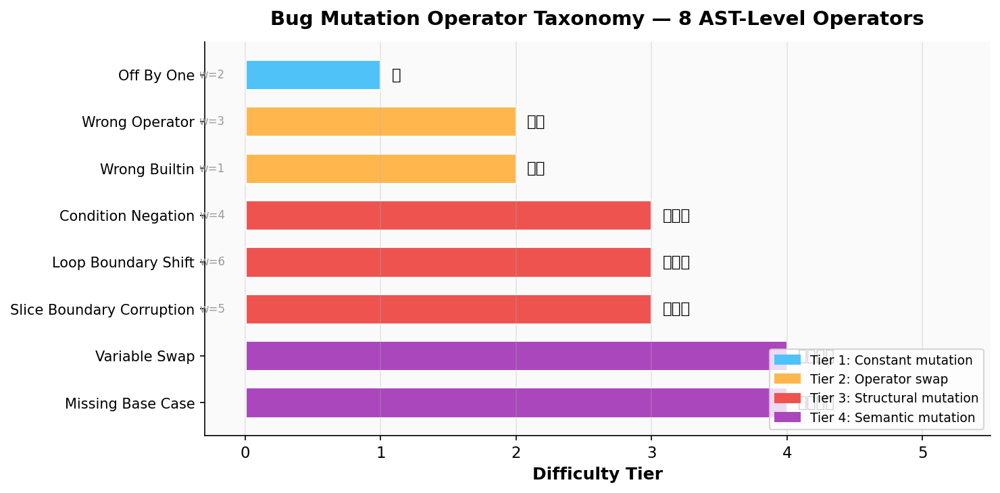
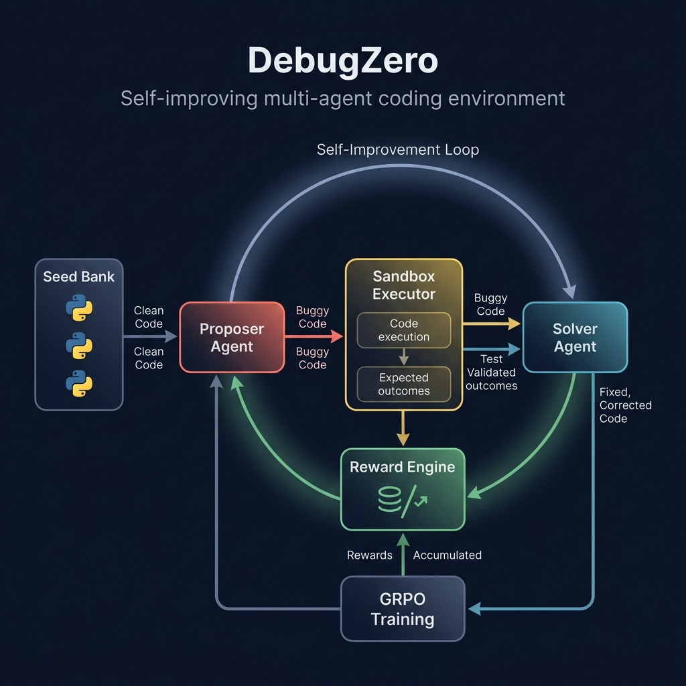
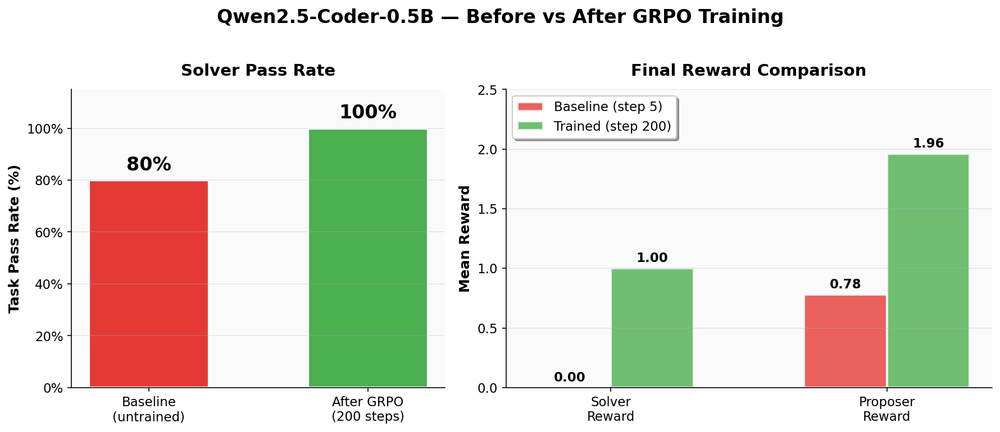
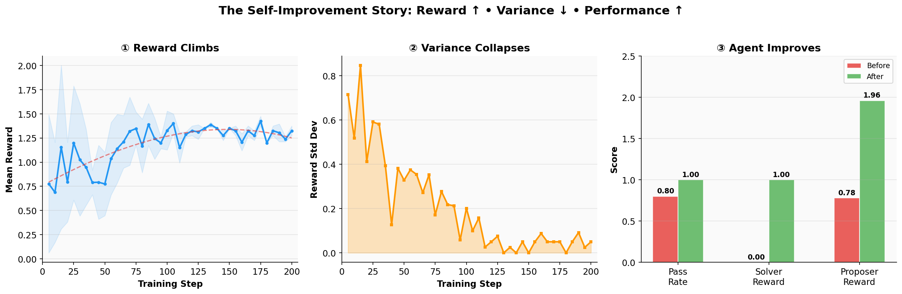
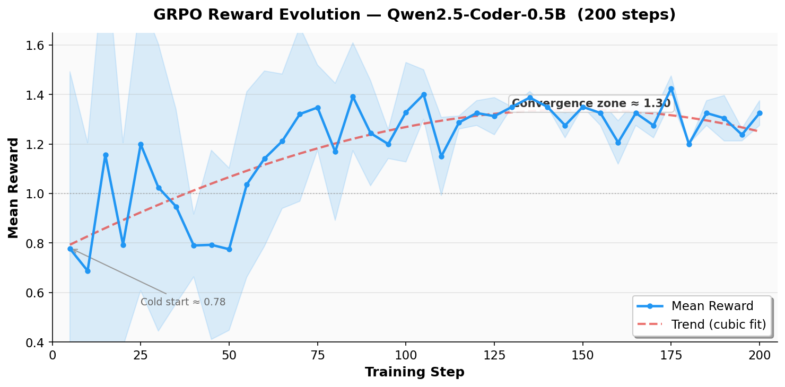
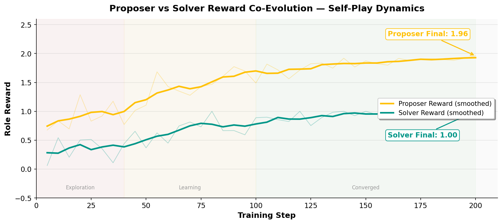
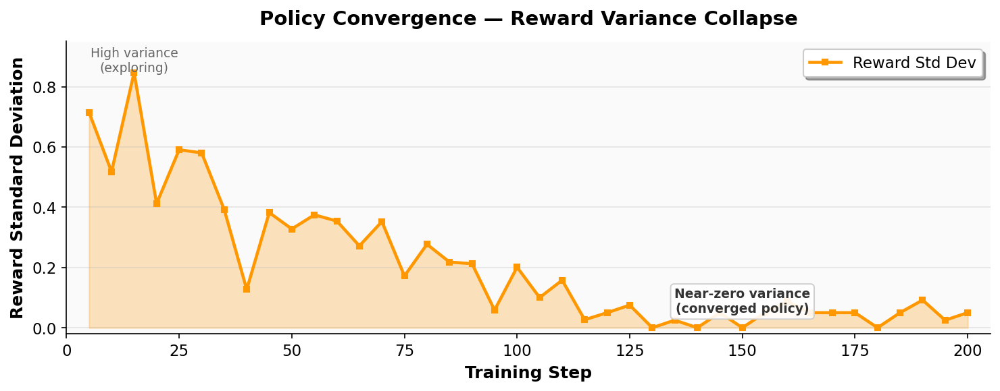
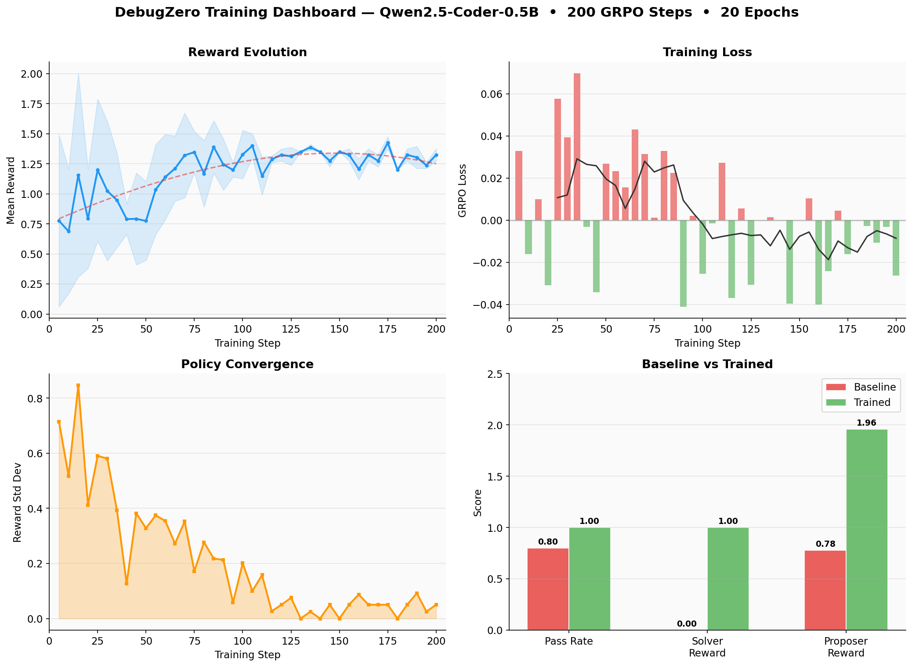

# DebugZero: A Self-Improving Multi-Agent Environment Where LLMs Learn to Break and Fix Code

> *Built for the Meta OpenEnv Hackathon — Theme #4: Self-Improvement*
>
> **Team:** Aniket Tripathi · Amit Singh · Asraful Hoque

---

## The Journey: How We Built DebugZero

When we started thinking about the Self-Improvement theme, we realized there is a fundamental gap in how code models are evaluated. Most benchmarks test if a model **can write code** from scratch, but real-world developers spend far more time **fixing near-correct code** — tracking down that one subtle mistake. 

And existing benchmarks measure a fixed capability. The bugs don't get harder as you get better. We wanted an environment where the challenges are self-generated, the difficulty adapts, and both creating and fixing bugs are treated as trainable skills. 

Here is how we progressively built DebugZero to solve this.

---

### Step 1: Building the Core Idea and Two-Role Setup

First, we implemented the core logic: an adversarial self-play environment where a single LLM plays two roles:
- **🎭 Proposer**: Takes a correct Python function and introduces exactly one small, realistic bug.
- **🔧 Solver**: Takes the buggy function (plus error logs) and repairs it.

The critical design choice was making both roles **share the same model**. This forces the agent to internalize both creating bugs and fixing them, mirroring how an expert programmer writes code while anticipating failure modes. 

**How an episode flows:**
The environment presents a clean function. The Proposer submits a bug. We parse it, safely execute it, and run tests. If the tests break, the Proposer succeeded. Then, the Solver gets the broken code and error logs and tries to fix it. If all tests pass again, the Solver succeeds.

---

### Step 2: Creating the Bug Factory

Next, we needed a way to measure the difficulty of the bugs. DebugZero doesn't inject bugs randomly. We implemented **8 AST-level mutation operators** from scratch using Python's `ast` module. 

  

*We grouped these operators into 4 difficulty tiers. The hardest ones (like variable swaps or missing base cases) change the program's meaning without obviously changing its structure.*

This ensured the bugs looked like **realistic programmer mistakes**, not random file corruption. We also added a safety pipeline (text scan → AST scan → sandboxed subprocess) to securely execute all model-generated code during training.

---

### Step 3: Designing the Reward Engine

Then, we designed the rewards to drive the self-improvement loop. This was a crucial piece to get right so the model wouldn't cheat.

**Proposer Rewards:**
- **Base reward (1.0)**: Earned when the code is safe, parses correctly, differs from the original, and actually causes tests to fail.
- **Plausibility bonus (up to 1.0)**: Measured using Levenshtein AST similarity. A targeted single-node mutation earns the full bonus. Random, destructive corruption earns nothing.
- **Learnability bonus (1.0)**: The environment tracks the Solver's rolling success rate. If the solve rate is in the "sweet spot" (20%–80%), the Proposer gets a bonus. **This creates an automatic difficulty curriculum.**

**Solver Rewards:** 
- **1.0** if all tests pass (bug repaired), **0.0** if tests still fail, and **−0.5** for syntax errors.

  

---

### Step 4: GRPO Training and Self-Improvement

Finally, we set up Group Relative Policy Optimization (GRPO) training using **Qwen2.5-Coder-0.5B-Instruct**. We deliberately chose a tiny 500M parameter model to prove that our self-improving environment has real signal—if it works for a 0.5B model, it's not simply brute-forcing solutions.

The training was mixed-role: the model saw both solver prompts and proposer prompts, with a 2:1 ratio favoring the solver.

**The Headline Result: 80% → 100%**

  

After just 200 GRPO steps (roughly 64 minutes on a single A100), the model's solver pass rate shot up from 80% to 100%. The proposer reward jumped from 0.78 to 1.96, indicating that it learned to inject minimal, targeted mutations.

  

  

*During training, we observed three clear phases: early exploration (high variance), rapid learning (reward climbs), and convergence.*

**Co-Evolution and Policy Convergence**

  

This is the beauty of self-play. The Proposer and Solver don't compete in a zero-sum game; they **co-evolve**. The Proposer learns to create increasingly plausible bugs, while the Solver learns to repair them. 

  

By step 120, the reward standard deviation collapsed to near-zero. **The model stopped guessing.** It found a stable, repeatable approach to both proposing and solving bugs.

We also noticed the model naturally became concise over time, shrinking its completions down to around 50 tokens (exactly what the task requires) while keeping its KL diversity tightly bounded so it wouldn't forget its pretrained knowledge.

  

*The complete 200-step training snapshot.*

---

## The Bottleneck: Fighting for Control

While analyzing the training dynamics, we noticed an important bottleneck that arose because we were using a tiny (0.5B) model.

Since the Proposer and Solver were part of the same base model and **shared the exact same adaptation network** (LoRA adapter), they began fighting for control over the weights as the training progressed. 

Solving a bug is sometimes purely syntax-driven, but proposing a *subtle, untrivial, yet plausible* bug requires deep reasoning and a larger capacity. Because the Solver tasks were easier for the model to optimize than the Proposer tasks, the Solver got significantly better, but the Proposer's quality began deteriorating late in the run. They were stepping on each other's toes within the shared adaptation network.

## The Future: Separated Adaptation & Alternating Roles

To resolve this capacity conflict in future iterations, we plan to implement a new multi-adaptation strategy:

1. **Dual Adaptation Networks:** Instead of one LoRA adapter, we will use **two separate adaptation networks** for the same base model — one dedicated to the Proposer and one dedicated to the Solver. Since they represent completely different cognitive tasks (generation vs repair), isolating them will allow each to learn effectively without causing catastrophic forgetting in the other.
2. **Alternating Role-Based Learning:** We will implement an alternating curriculum loop where at one step, the Proposer adapter is completely **frozen** and simply acts as a realistic bug generator. The Solver adapter will then train on this generated dataset and improve. In the next phase, the Solver adapter is frozen, and the Proposer trains against it to discover new blind spots. 

By freezing one and training the other in alternating rounds, we will stabilize the adversarial learning dynamics and maintain the self-improving curriculum even longer.

---

## Conclusion & Links

DebugZero shows that **self-play can create a genuine training curriculum for code debugging** without manual task curation. By building the environment layer by layer, starting with core safety and bug operators, progressing to a dynamic reward engine, and finally closing the loop with GRPO training, we turned failure into an engine for learning.

The next generation of code agents won't just be models that write code well. They will be models that understand how code breaks — and can recover from those breaks efficiently and precisely. 

- **🤗 Hugging Face Space**: [The-Fool-09/debugZero](https://huggingface.co/spaces/The-Fool-09/debugZero)
- **📂 GitHub Repository**: [Ray-0906/DebugZero](https://github.com/Ray-0906/DebugZero)
- **📓 Training Notebook**: [`MAIN_TRAINING_NOTEBOOK/train_colab_updated_1.ipynb`](MAIN_TRAINING_NOTEBOOK/train_colab_updated_1.ipynb)

> *DebugZero: Where one agent's bug is another agent's curriculum.*
