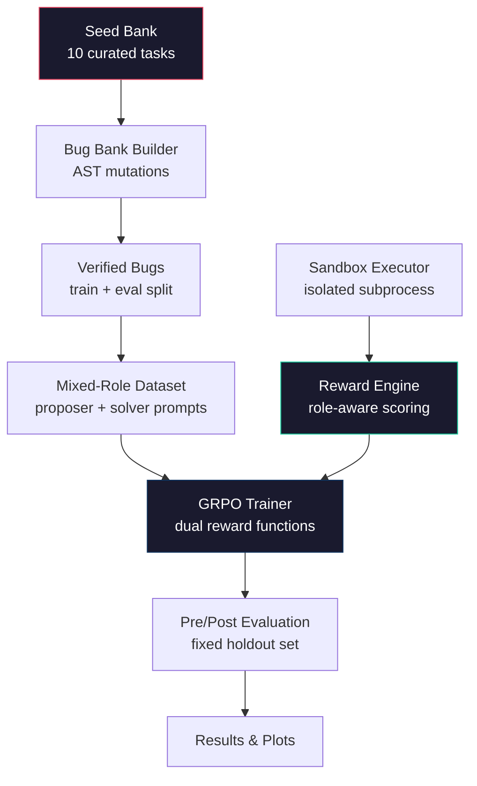
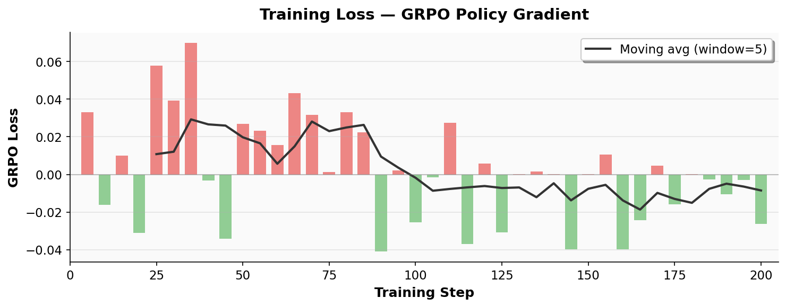
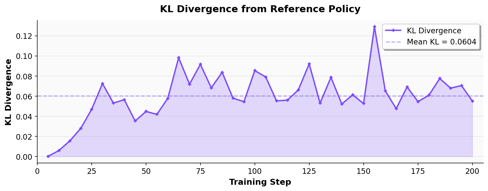
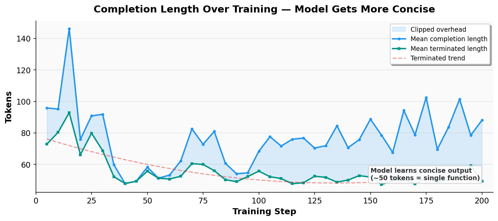
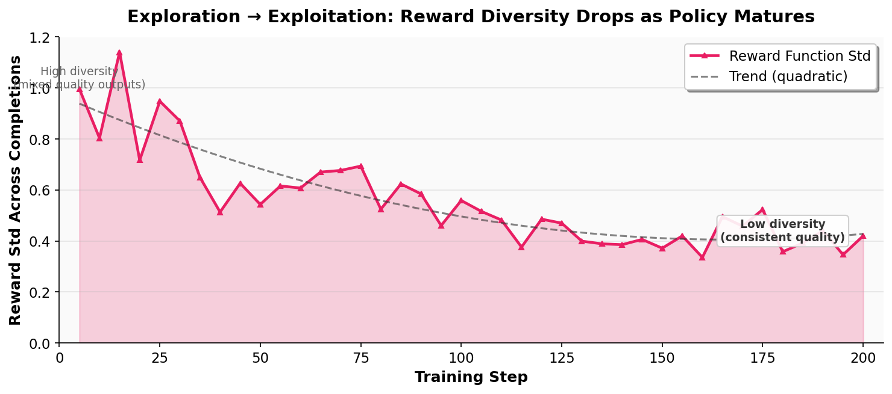
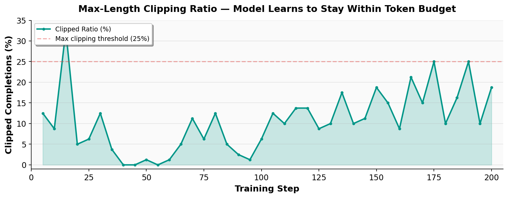

<div align="center">

# 🧬 DebugZero

### *A Self-Improving Multi-Agent Coding Environment for Recursive Capability Growth*

[]()
[]()
[]()
[]()
[](https://huggingface.co/spaces/The-Fool-09/debugZero)
[](./notebooks/train_colab_upate_1.ipynb)

---

**Two LLM agents co-evolve through adversarial code generation and repair, creating an automatic curriculum for coding intelligence — no human-curated tasks required at training time.**

</div>

---

## 📋 Table of Contents

- [Executive Summary](#-executive-summary)
- [Problem Statement](#-problem-statement)
- [Core Idea: Self-Play Debugging](#-core-idea-self-play-debugging)
- [How the Environment Works](#-how-the-environment-works)
- [Architecture](#-architecture)
- [Task Design & Difficulty Taxonomy](#-task-design--difficulty-taxonomy)
- [Bug Mutation Operators](#-bug-mutation-operators)
- [Reward Mechanism (with LaTeX)](#-reward-mechanism)
- [Grading System & Plausibility Scoring](#-grading-system--plausibility-scoring)
- [Training Setup (GRPO)](#-training-setup-grpo)
- [Models Tested](#-models-tested)
- [Results & Plots](#-results--plots)
- [Why This Matters](#-why-this-matters)
- [Future Work](#-future-work)
- [How To Run](#-how-to-run)
- [Repository Guide](#-repository-guide)
- [Media & Writeup](#-media--writeup)
- [Team](#-team)

---

## 🎯 Executive Summary

We present **DebugZero**, a self-improving training environment where one LLM generates increasingly difficult buggy code challenges while another LLM learns to solve them. Through **GRPO-based reinforcement learning**, both agents recursively improve over time, creating an **autonomous curriculum without manually curated tasks**.

The key insight is simple: **the best way to learn debugging is to practice against an adversary that keeps inventing new bugs.** The better the solver gets, the harder the proposer must try — and vice versa. This creates a natural spiral of capability growth.

> **What makes DebugZero different from static benchmarks?**
> Static benchmarks like HumanEval measure a fixed capability. DebugZero is a living environment: the difficulty adapts, the curriculum self-generates, and the agent's skill ceiling continuously rises.

<p align="center">
  
</p>

*The self-improvement story in 3 panels: ① Reward climbs from 0.78 to ~1.35 over 200 training steps. ② Reward variance collapses to near-zero, proving a converged policy. ③ Baseline vs trained comparison: pass rate 80% → 100%, Solver reward 0.00 → 1.00, Proposer reward 0.78 → 1.96.*

---

## 🔍 Problem Statement

There is a fundamental gap between **"can write code"** and **"can debug code."**

Most code models are trained to autocomplete or generate from scratch. But real-world developers spend far more time **fixing near-correct code** — finding the one subtle mistake and repairing it without breaking everything else.

| Capability | Static Benchmarks | DebugZero |
|:---|:---|:---|
| Task Source | Human-curated, fixed | Self-generated, evolving |
| Difficulty Scaling | None | Automatic curriculum |
| Adversarial Pressure | None | Proposer-Solver co-evolution |
| Skill Ceiling | Fixed by benchmark | Recursively amplified |
| Evaluation Signal | Binary pass/fail | Role-aware, multi-dimensional |

A good debugger must:
- Read an implementation and **preserve the intent**
- Notice a small logical bug — not just syntax problems
- Use **test failures as evidence** to guide repair
- Apply the **smallest correct fix** (avoid unnecessary rewrites)

DebugZero turns all four of those into a measurable, trainable environment.

---

## 🧠 Core Idea: Self-Play Debugging

DebugZero implements **recursive skill amplification** through adversarial self-play between two roles that share a single model:

```
┌─────────────────────────────────────────────────────┐
│                  SELF-IMPROVEMENT LOOP               │
│                                                      │
│   🎭 Proposer ──→ 🧪 Sandbox ──→ 🔧 Solver          │
│        ↑              │               │             │
│        │         execution +           │             │
│        │         test results          │             │
│        │               │               ↓             │
│        └───── 📊 Reward Engine ←──────┘             │
│                    │                                 │
│               ⚡ GRPO Training                       │
│         (both roles improve together)                │
└─────────────────────────────────────────────────────┘
```

> **Key Design Decision:** The Proposer and Solver are the **same model** — enabling the agent to internalize *both* the skill of creating realistic bugs *and* the skill of fixing them. This mirrors how expert programmers think: they anticipate failure modes *while writing code*, not just after.

---

## ⚙ How the Environment Works

### Episode Lifecycle

Each episode is a two-step game:

```
Step 1: PROPOSER TURN
┌──────────────┐     ┌────────────────┐     ┌───────────────┐
│  Seed Bank   │────▶│    Proposer    │────▶│   Sandbox     │
│ (clean code) │     │ (inject 1 bug) │     │ (run tests)   │
└──────────────┘     └────────────────┘     └───────┬───────┘
                                                    │
                                         tests fail? ✓
                                                    │
Step 2: SOLVER TURN                                 ▼
┌──────────────┐     ┌────────────────┐     ┌───────────────┐
│  Buggy Code  │────▶│     Solver     │────▶│   Sandbox     │
│ + Error Logs │     │  (repair bug)  │     │ (run tests)   │
└──────────────┘     └────────────────┘     └───────┬───────┘
                                                    │
                                         tests pass? ✓
                                                    │
                                                    ▼
                                            EPISODE COMPLETE
```

### What the Agent Sees

After every step, the environment returns a structured observation:

| Field | Type | Description |
|:---|:---|:---|
| `current_code` | `str` | The Python code in its current state |
| `execution_result` | `str` | Sandbox output (stdout/stderr, truncated to 500 chars) |
| `tests_passed` | `bool` | Whether all test assertions succeeded |
| `syntax_error` | `bool` | Whether the code failed to parse |
| `role_next` | `str` | Which role plays next (`proposer` or `solver`) |
| `score` | `float` | Episode progress score ∈ [0.0, 1.0] |
| `metadata` | `dict` | Includes `seed_id`, `original_code`, and `bug_operator` |

### What the Agent Does

The action space is deliberately minimal:

- **Proposer**: Submits a *full Python function* containing exactly one small logical bug.
- **Solver**: Submits a *full repaired Python function*.

This simplicity is intentional — it forces the model to reason about entire functions rather than emitting isolated patches.

---

## 🏗 Architecture

<p align="center">
  
</p>

### System Components



### Component Map

| Layer | Files | Responsibility |
|:---|:---|:---|
| **Task & Data** | `server/tasks.py`, `bug_bank.py` | Curated seed functions + verified bug generation |
| **Environment** | `server/debugZero_environment.py` | State machine orchestrating Proposer ↔ Solver turns |
| **Execution** | `server/executor.py` | Sandboxed Python execution with safety guards |
| **Mutation** | `server/bug_injector.py` | AST-level bug injection across 8 operator families |
| **Grading** | `server/graders.py` | Reward computation, plausibility scoring, solve-rate history |
| **Training** | `training/grpo_train.py`, `training/dual_role_sampler.py` | GRPO pipeline with role-specific prompts |
| **Evaluation** | `eval/api_baseline.py` | Deterministic controls + live API probing |
| **Inference** | `inference.py` | Multi-episode inference runner with structured logging |

---

## 📚 Task Design & Difficulty Taxonomy

### Seed Bank Overview

DebugZero uses **10 curated Python tasks** spanning three difficulty tiers. Each task includes a clean reference implementation and a test harness.

### 🟢 Easy Mode — Single-Concept Functions

These tasks test a single algorithmic concept with straightforward control flow.

| Task | Function | Core Concept | Why It's Easy |
|:---|:---|:---|:---|
| `DebugZero/1` | `sum_to_n(n)` | Accumulation loop | Linear loop, no branching |
| `DebugZero/4` | `count_nonempty(strings)` | Conditional counting | Simple filter + count |
| `DebugZero/7` | `drop_last(values)` | Slice operation | One-liner with edge case |

**Bug injection strategy**: Off-by-one errors, wrong operators (`+` ↔ `-`), and boundary shifts create subtle failures while keeping the function structure intact.

### 🟡 Medium Mode — Multi-Condition Logic

These tasks involve compound conditions, multiple code paths, or stateful iteration.

| Task | Function | Core Concept | Why It's Medium |
|:---|:---|:---|:---|
| `HumanEval/0` | `has_close_elements(numbers, threshold)` | Nested iteration + comparison | Dual loop, floating-point threshold |
| `DebugZero/2` | `middle_slice(values)` | Boundary slicing | Length check + slice index math |
| `DebugZero/5` | `running_max(values)` | Stateful tracking | Conditional update + initialization |
| `DebugZero/6` | `first_index_of(values, target)` | Search with sentinel return | Early return logic + default case |

**Bug injection strategy**: Condition negation, wrong comparison operators (`<` → `>=`), and slice boundary corruption produce bugs that require understanding the relationship between conditions.

### 🔴 Hard Mode — Algorithmic Reasoning

These tasks require reasoning about accumulators, invariants, or prefix computations.

| Task | Function | Core Concept | Why It's Hard |
|:---|:---|:---|:---|
| `DebugZero/3` | `is_non_decreasing(values)` | Monotonicity invariant | Generator expression with index math |
| `DebugZero/8` | `count_greater_than(values, threshold)` | Threshold comparison | Strict vs. non-strict inequality trap |
| `DebugZero/9` | `prefix_sums(values)` | Running accumulation | Accumulator + append ordering |

**Bug injection strategy**: Loop boundary shifts, wrong builtins (`min` ↔ `max`), and off-by-one errors in accumulator initialization create bugs that require understanding the algorithm's invariant, not just its syntax.

---

## 🧬 Bug Mutation Operators

DebugZero uses **8 AST-level mutation operators** implemented from scratch via Python's `ast` module. Each operator models a realistic class of programmer mistakes:

| Operator | Mutation Type | Example | Difficulty |
|:---|:---|:---|:---|
| `off_by_one` | Integer constant ± 1 | `range(n+1)` → `range(n+2)` | ⭐ |
| `wrong_operator` | Comparison/arithmetic swap | `<` → `>=`, or `+` → `-` | ⭐⭐ |
| `wrong_builtin` | Built-in function swap | `min()` → `max()` | ⭐⭐ |
| `condition_negation` | Logic inversion | `if x > 0` → `if not x > 0` | ⭐⭐⭐ |
| `loop_boundary_shift` | Range argument ± 1 | `range(n)` → `range(n+1)` | ⭐⭐⭐ |
| `slice_boundary_corruption` | Slice index shift | `values[1:-1]` → `values[1+1:-1]` | ⭐⭐⭐ |
| `variable_swap` | Tuple target reorder | `a, b = x, y` → `b, a = x, y` | ⭐⭐⭐⭐ |
| `missing_base_case` | Return → pass | `return []` → `pass` | ⭐⭐⭐⭐ |

<p align="center">
  
</p>

*Visual taxonomy of all 8 operators, grouped by difficulty tier. Priority weights (w) are used by the reward engine to score bug difficulty. Tier 4 (semantic mutations) are the hardest: they change the program's meaning without obviously changing its structure.*

### Bug Difficulty Scoring

Each generated bug is scored for difficulty using a composite formula:

$$D(\text{bug}) = w_{\text{op}} + \mathrm{sim}_{\text{AST}}(\text{original}, \text{mutated}) + \min\!\left(\frac{L_{\text{error}}}{4},\; 1.0\right)$$

Where:

| Component | What It Measures | Range |
|:---|:---|:---|
| $w_{\text{op}}$ | Operator priority weight (higher = harder family) | 1–6 |
| $\mathrm{sim}_{\text{AST}}$ | How close the mutated AST is to the original | 0.0–1.0 |
| $L_{\text{error}}$ | Length of execution error output | 0–∞ |

**The hardest bugs are those that change very little in the code structure but produce diagnostic error messages that require careful reasoning to interpret.**

The priority weights for each operator family:

| Operator | Priority Weight ($w_{\text{op}}$) |
|:---|:---|
| `wrong_builtin` | 1 |
| `off_by_one` | 2 |
| `wrong_operator` | 3 |
| `condition_negation` | 4 |
| `slice_boundary_corruption` | 5 |
| `loop_boundary_shift` | 6 |

---

## 💰 Reward Mechanism

The reward system is the heart of DebugZero's self-improvement loop. Both roles receive **role-specific rewards** that incentivize distinct skills.

### Proposer Reward Function

$$R_{\text{proposer}}(\mathbf{x}) = \begin{cases} -0.5 & \text{if syntax error or unsafe code} \\ \;\;\;0.0 & \text{if code unchanged} \\ -0.1 & \text{if changed but tests still pass} \\ \;\;\;0.0 & \text{if tests pass (unchanged)} \\ \;\;\;1.0 + \beta_{\text{plaus}} + \beta_{\text{learn}} & \text{if tests fail (valid bug created)} \end{cases}$$

Where:

**Plausibility Bonus** $\beta_{\text{plaus}}$ — Rewards bugs that look like realistic programmer mistakes, not random corruption:

$$\beta_{\text{plaus}} = \mathrm{dist}_{\text{AST}}(\text{original},\;\text{mutated}) = \begin{cases} 1.0 & \text{if fuzz ratio} \geq 85\% \\ \max\!\left(0.1,\; \frac{\text{fuzz ratio} - 50}{35}\right) & \text{if } 50\% \leq \text{fuzz ratio} \lt 85\% \\ 0.0 & \text{if fuzz ratio} \lt 50\% \end{cases}$$

The plausibility score uses **Levenshtein-based AST similarity** (via `thefuzz`). A targeted single-node mutation typically scores 85–98% similarity → full bonus. Random wide corruption scores below 50% → zero bonus.

**Learnability Bonus** $\beta_{\text{learn}}$ — Incentivizes bugs that are neither trivially easy nor impossibly hard for the solver:

$$\beta_{\text{learn}} = \begin{cases} 1.0 & \text{if } 0.2 \leq \bar{s}_{\text{seed}} \leq 0.8 \\ 0.0 & \text{otherwise} \end{cases}$$

Where $\bar{s}_{\text{seed}}$ is the **rolling solve rate** for the current seed task (exponential window of last 20 episodes). This creates **automatic curriculum generation**: the proposer is pushed toward the "zone of proximal development" — tasks hard enough to challenge the solver but not so hard they produce zero learning signal.

### Solver Reward Function

The solver reward is intentionally simpler and more direct:

$$R_{\text{solver}}(\mathbf{x}) = \begin{cases} -0.5 & \text{if syntax error or unsafe code} \\ \;\;\;0.0 & \text{if tests still fail} \\ \;\;\;1.0 & \text{if all tests pass (bug successfully repaired)} \end{cases}$$

### Why This Reward Design Works

| Design Choice | Reasoning |
|:---|:---|
| **Penalty for syntax errors** (−0.5) | Prevents degenerate outputs; models must produce valid Python |
| **Zero reward for no change** | The proposer can't "cheat" by returning the original code |
| **Negative reward for changed-but-passing** (−0.1) | Discourages cosmetic refactors that don't actually break tests |
| **Plausibility bonus** | Incentivizes realistic bugs over random corruption |
| **Learnability bonus** | Creates an automatic difficulty curriculum |
| **Simple solver reward** | Keeps solver optimization stable and interpretable |

---

## 🎓 Grading System & Plausibility Scoring

### Episode Scoring

The environment tracks episode progress through a composite score:

| Event | Score |
|:---|:---|
| Proposer creates a valid bug (tests fail, no syntax error) | 0.5 |
| Solver successfully repairs the bug (all tests pass) | 1.0 |
| Proposer fails (syntax error, unchanged, or tests still pass) | 0.0 |
| Solver fails (syntax error or tests still fail) | 0.5 (if proposer succeeded) |

### Code Safety Validation

Every code submission is validated through a **three-layer safety pipeline**:

1. **Text-level scan**: Block dangerous imports (`os`, `sys`, `subprocess`, `shutil`, `pathlib`) and dangerous builtins (`__import__`, `eval`, `exec`, `open`)
2. **AST-level scan**: Walk the full parse tree to detect disguised dynamic imports and aliased dangerous calls
3. **Subprocess isolation**: Execute code in a sandboxed subprocess with a **5-second timeout**

### Solve Rate History

The grading system maintains a **rolling window** (last 20 episodes) of solve rates per seed task:

$$\bar{s}_{\text{seed}} = \frac{1}{\min(N, 20)} \sum_{i=1}^{\min(N, 20)} \mathbb{1}[\text{solved}_i]$$

This solve rate history serves two critical functions:
1. **Feeds the learnability bonus** — keeping bugs in the productive difficulty range
2. **Enables weighted proposer prompt sampling** — seeds with lower break rates get more training emphasis

---

## 🏋 Training Setup (GRPO)

### Algorithm: Group Relative Policy Optimization

DebugZero uses **GRPO** (Group Relative Policy Optimization) from TRL, which is particularly well-suited for self-play environments because it:
- Generates **multiple completions per prompt** and ranks them by reward
- Optimizes the policy using **relative advantages** within each group
- Avoids the instability of absolute reward signals in adversarial settings

### Training Configuration

| Parameter | Value | Rationale |
|:---|:---|:---|
| Base Model | `Qwen2.5-Coder-0.5B-Instruct` | Deliberately tiny — proves the environment works even with minimal model capacity |
| Learning Rate | $2 \times 10^{-5}$ | Conservative to prevent catastrophic forgetting |
| Batch Size | 1 (per device) | Memory constraint with code execution overhead |
| Gradient Accumulation | 4 steps | Effective batch size of 4 |
| Generations per Prompt | 4 | GRPO group size for ranking |
| Max Steps | 200 | Full training run (20 epochs) |
| Max Prompt Length | 768 tokens | Sufficient for code + context |
| Max Completion Length | 256 tokens | Sufficient for single-function output |
| Precision | bfloat16 | Via Unsloth, with smart gradient offloading |
| LoRA Rank | 16 | Efficient fine-tuning of attention + MLP layers |
| Optimizer | AdamW 8-bit | Memory-efficient optimization |
| Runtime | ~64 minutes | On a single A100 GPU |

### Dataset Composition

The training dataset is **mixed-role** by design:

| Component | Count | Purpose |
|:---|:---|:---|
| Solver prompts | 18–40 | Repair verified bugs (heavier weight) |
| Proposer prompts | 9–10 | Generate new bugs (lighter but present) |
| **Total rows** | **27–50** | Per training build |

The **2:1 solver-to-proposer ratio** is deliberate: solver rewards have a cleaner gradient, so heavier solver representation stabilizes training while still exposing the model to proposer reasoning.

### Weighted Proposer Sampling

Proposer prompts are **not sampled uniformly**. The system uses prior break rates to oversample:
- Seeds where the proposer historically struggles (lower break rate → higher weight)
- Underrepresented bug operator families (rarer operators get priority)

75% of proposer prompts include a **targeted bug focus instruction** (e.g., "Focus on `loop_boundary_shift`"), encouraging operator diversity.

### Training Loop

```
1. Build verified bug bank from seed tasks
2. Construct mixed-role dataset (solver-heavy)
3. Evaluate model on fixed holdout set (PRE-training baseline)
4. Run GRPO training with dual reward functions
5. Evaluate model on same holdout set (POST-training comparison)
6. Save comparison plots + metrics JSON
```

---

## 🤖 Models Tested

| Model | Parameters | Purpose | Notes |
|:---|:---|:---|:---|
| `Qwen2.5-Coder-0.5B-Instruct` | 0.5B | **Featured training run** ✅ | Proves the environment works even with the smallest model |
| `Qwen2.5-Coder-1.5B-Instruct` | 1.5B | Mid-range training | Good balance for development |
| `Qwen2.5-Coder-3B-Instruct` | 3B | Default training target | Best capability-to-cost ratio |
| `Qwen2.5-Coder-7B-Instruct` | 7B | Strong evaluation baseline | Used for API smoke tests |
| `Meta-Llama-3.1-8B-Instruct` | 8B | Cross-architecture evaluation | Tests generalization beyond Qwen |

> **Why start with 0.5B?** If a self-improving environment can teach a 500M-parameter model to go from 80% → 100% task pass rate, that is strong evidence the environment has real signal — not that a large model is brute-forcing solutions.

---

## 📊 Results & Plots

### The Story in One Paragraph

We trained **Qwen2.5-Coder-0.5B** — one of the smallest code models available — inside the DebugZero environment for **200 GRPO steps** (~64 minutes on a single A100). Before training, the model could already solve 8 out of 10 debugging tasks (80%). After training, it solved **all 10 (100%)**. The proposer reward rose from 0.78 to 1.96, meaning the model learned not only to fix bugs but also to *create* realistic, plausible ones. The solver achieved a perfect reward of 1.0. Reward variance collapsed to near-zero by step ~120, indicating a converged, stable policy.

### Training Dashboard

<p align="center">
  
</p>

*Four-panel training dashboard: (top-left) mean reward climbing from 0.78 to ~1.35 with confidence band, (top-right) GRPO loss oscillating around zero as the policy stabilizes, (bottom-left) reward standard deviation collapsing to near-zero proving convergence, (bottom-right) baseline vs trained comparison across all metrics.*

---

### 1. Environment Validation (Before Training)

Before any model touches the environment, we run deterministic controls to prove the environment has real signal:

| Check | Result | What It Proves |
|:---|:---|:---|
| Canonical code passes all tests | ✅ 10/10 | The reference implementations are correct |
| Verified buggy code fails tests | ✅ 10/10 | The generated bugs actually break behavior |
| Syntax errors are detected cleanly | ✅ 10/10 | The executor correctly identifies parse failures |

This is important: the environment is not a toy. Clean code passes, broken code fails, and invalid code is rejected.

### 2. Baseline vs Trained — The Headline Result

<p align="center">
  
</p>

*Left: Solver pass rate improved from 80% (baseline) to 100% (trained). Right: Both Solver and Proposer rewards increased dramatically after 200 GRPO steps.*

| Metric | Baseline (Untrained) | After GRPO (200 steps) | Change |
|:---|:---|:---|:---|
| **Solver Pass Rate** | 80% (8/10) | **100% (10/10)** | **+20%** ✅ |
| **Solver Mean Reward** | ≈ 0.00 | **1.00** | **+1.00** |
| **Proposer Mean Reward** | ≈ 0.78 | **1.96** | **+1.18** |
| **Reward Std Dev (final)** | 0.72 | **0.05** | Converged |

The proposer reward of 1.96 means the model consistently earns the base reward (1.0) plus the full plausibility bonus (≈1.0), meaning it learned to inject **targeted, realistic bugs** — not random corruption.

### 3. Reward Evolution Over Training

<p align="center">
  
</p>

*Mean reward over 200 GRPO steps. The blue band shows ±1 standard deviation. The red dashed line is a cubic trend fit. Reward rises sharply in the first 75 steps, then stabilizes around 1.30 — indicating the model has learned a reliable strategy for both bug injection and repair.*

**Three training phases are visible:**

| Phase | Steps | Reward | What's Happening |
|:---|:---|:---|:---|
| **Exploration** | 1–40 | 0.68–1.20 | High variance; model exploring different bug strategies |
| **Rapid Learning** | 40–100 | 1.00–1.40 | Reward climbing; model discovering effective patterns |
| **Convergence** | 100–200 | 1.20–1.43 | Stable policy; near-zero reward variance |

### 4. Policy Convergence — Reward Variance Collapse

<p align="center">
  
</p>

*Reward standard deviation across training. Early high variance (exploring) collapses to near-zero by step ~120. This is the clearest signal of a converged policy — the model has found a reliable strategy and stopped guessing.*

This plot is arguably the most important: it proves the model didn't just get lucky. It learned a **stable, repeatable** approach to both proposing and solving bugs.

### 5. Training Loss

<p align="center">
  
</p>

*GRPO policy gradient loss over 200 steps. Green bars = steps that improved the policy; red bars = corrective steps. The 5-step moving average hovers near zero, which is expected behavior for a converging GRPO policy (the relative advantage within each group approaches zero as all completions become equally good).*

### 6. KL Divergence from Reference

<p align="center">
  
</p>

*KL divergence between the training policy and the reference (pretrained) model. Mean KL ≈ 0.065. The divergence stays bounded and stable, meaning the model improved its debugging skill without forgetting its pretrained coding knowledge.*

### 7. Proposer vs Solver Co-Evolution

<p align="center">
  
</p>

*Proposer (amber) and Solver (teal) rewards plotted over training. Both roles improve simultaneously — the hallmark of self-play co-evolution. The Proposer learns to create increasingly plausible bugs (final reward: 1.96), while the Solver learns to repair them (final reward: 1.00). Background shading marks the three training phases: Exploration → Learning → Converged.*

### 8. Completion Length — Model Gets Concise

<p align="center">
  
</p>

*Completion token length over training. The gap between total and terminated length represents clipped (max-length) completions. Early in training, the model produces verbose, unfocused output (~95–146 tokens). By step 40, it learns to produce concise, single-function output (~50 tokens), exactly what the task requires.*

### 9. Reward Diversity — Exploration to Exploitation

<p align="center">
  
</p>

*Standard deviation of reward across completions within each GRPO group. High diversity early on means the model is exploring many strategies (some good, some bad). The steady decline shows the model settling on a reliable approach — the transition from exploration to exploitation that every successful RL run exhibits.*

### 10. Clipping Ratio — Staying Within Token Budget

<p align="center">
  
</p>

*Percentage of completions that hit the max-length limit (256 tokens). This oscillates but generally stays manageable, confirming that the model has learned to express its solutions within the allocated token budget. Spikes indicate occasional verbose completions on harder tasks.*

### 11. Final Reward Breakdown

These are the final average rewards computed over the last 50 completions of training:

```
========================================
FINAL REWARD METRICS (Last 50 Completions)
========================================
Final Average Proposer Reward: 1.9566
Final Average Solver Reward:   1.0000
========================================
Baseline Pass Rate: 8/10  (80.0%)
Trained Pass Rate:  10/10 (100.0%)
========================================
```

**What these numbers mean:**

- **Proposer Reward 1.96** = $1.0$ (base: valid bug created) $+ \sim1.0$ (plausibility bonus: AST similarity > 85%). The model learned to inject *minimal, targeted* mutations.
- **Solver Reward 1.00** = Perfect. Every bug the proposer creates, the solver can now fix.
- **100% Pass Rate** = The trained model solves all 10 holdout debugging tasks — including both tasks it couldn't solve before training.

---

## 🌍 Why This Matters

### For Coding-Agent Researchers

DebugZero turns debugging into a **measurable environment** with executable feedback. Instead of relying on human-labeled datasets of bugs, the environment generates its own challenges at the right difficulty level. This means:
- No dataset curation bottleneck
- Infinitely scaling training data
- Natural difficulty progression

### For RL-for-Code Work

The reward signal is **richer than simple pass/fail** while still staying grounded in tests. The plausibility bonus, learnability bonus, and solve-rate history create a reward landscape that shapes behavior in meaningful ways — not just "did the code work?" but "did the model learn the right skills?"

### For Developer Tools

DebugZero targets the everyday regime where code is **almost correct** and small repairs matter more than full rewrites. This is exactly the use case for:
- AI-powered code review
- Automated bug triage
- IDE-integrated repair suggestions

### For the Self-Improvement Theme

DebugZero demonstrates all four pillars of **recursive skill amplification**:

| Pillar | How DebugZero Implements It |
|:---|:---|
| **Self-generated challenges** | The Proposer creates new bugs — no human in the loop |
| **Automatic difficulty escalation** | Learnability bonus pushes bugs to the optimal difficulty |
| **Self-play co-evolution** | Proposer and Solver roles drive each other's improvement |
| **Adaptive curriculum** | Solve-rate history dynamically reweights training emphasis |

### The Deeper Argument

Self-improvement for code agents should not only mean *"generate more code."* It should also mean:
- **Generate the right failures** (Proposer)
- **Learn from those failures** (Solver)  
- **Recover gracefully** (Minimal repair)

DebugZero trains all three skills in a single self-play loop. The result is an agent that doesn't just write code — it understands how code breaks and how to fix it.

---

## 🔮 Future Work

| Direction | Description | Impact |
|:---|:---|:---|
| **Larger Seed Bank** | Scale from 10 to 100+ tasks (e.g., full HumanEval, MBPP) | Broader skill coverage |
| **Multi-Language Support** | Extend to JavaScript, Rust, Go | Cross-language debugging transfer |
| **Multi-Turn Episodes** | Allow iterative repair attempts with feedback loops | Closer to real debugging workflows |
| **ELO-Style Ratings** | Track Proposer/Solver skill ratings across episodes | Quantify co-evolution dynamics |
| **Harder Bug Families** | Add type confusion, logic race conditions, off-by-n | More realistic failure modes |
| **Curriculum Visualization** | Live dashboards showing difficulty progression | Better training observability |
| **Cross-Model Self-Play** | Pit different model sizes against each other | Measure transfer and scaling |

---

## 🚀 How To Run

### Prerequisites

- Python 3.10+
- [UV package manager](https://github.com/astral-sh/uv) (recommended)

### Install Dependencies

```bash
uv sync
```

### Start the Environment Server

```bash
uv run --project . server
```

The server starts on `http://localhost:8000` with the following endpoints:
- `GET /health` — Health check
- `POST /reset` — Reset the environment
- `POST /step` — Take an action

### Run Deterministic Validation

```bash
python -X utf8 eval/api_baseline.py
```

This verifies that the environment has real signal before any model is involved.

### Run Multi-Episode Inference

```bash
python -X utf8 inference.py
```

Produces structured `[START]`, `[STEP]`, and `[END]` logs for each episode.

### Run GRPO Training (Smoke Test)

```bash
python -X utf8 training/grpo_train.py --dry_run
```

Runs a quick local training loop with a tiny model (2 steps) to verify the full pipeline.

### Run Full GRPO Training

```bash
python -X utf8 training/grpo_train.py
```

Full training with `Qwen2.5-Coder-3B-Instruct` for 80 steps. Requires GPU.

### Docker Deployment

```bash
docker build -t debugzero .
docker run -p 8000:8000 debugzero
```

---

## 📁 Repository Guide

| File | Role |
|:---|:---|
| [`server/tasks.py`](server/tasks.py) | Curated task bank — 10 seed functions with test harnesses |
| [`bug_bank.py`](bug_bank.py) | Verified bug generation with train/eval split |
| [`server/debugZero_environment.py`](server/debugZero_environment.py) | Main environment state machine (the core) |
| [`server/executor.py`](server/executor.py) | Sandboxed execution with safety guards |
| [`server/bug_injector.py`](server/bug_injector.py) | AST mutation engine — 8 operator families |
| [`server/graders.py`](server/graders.py) | Reward computation + plausibility scoring |
| [`training/dual_role_sampler.py`](training/dual_role_sampler.py) | Role-specific prompt templates |
| [`training/grpo_train.py`](training/grpo_train.py) | Full GRPO training pipeline |
| [`eval/api_baseline.py`](eval/api_baseline.py) | Deterministic controls + live API probing |
| [`inference.py`](inference.py) | Multi-episode inference runner |
| [`models.py`](models.py) | Pydantic data models (Action, Observation, State) |
| [`client.py`](client.py) | Environment client wrapper |
| [`implementation.md`](implementation.md) | Detailed implementation guide |

---

## 🔗 Project Links

- **Hugging Face Space**: [The-Fool-09/debugZero](https://huggingface.co/spaces/The-Fool-09/debugZero)
- **GitHub Repository**: [The-Fool-09/debugZero](https://github.com/The-Fool-09/debugZero)

---

## 📽 Media & Writeup

> [!IMPORTANT]  
> **Final Submission Assets**
> - **Mini-Blog / Writeup**: [📌 INSERT BLOG LINK HERE]
> - **Demonstration Video**: [🎬 INSERT YOUTUBE LINK HERE]
> - **Training Notebook**: [📓 train_colab_upate_1.ipynb](./notebooks/train_colab_upate_1.ipynb)

---

## 👥 Team

Built for the **Meta OpenEnv Hackathon** — Theme #4: Self-Improvement.

- **Aniket Tripathi**
- **Amit Singh**
- **Asraful Hoque**

🔗 **Hugging Face Space**: [The-Fool-09/debugZero](https://huggingface.co/spaces/The-Fool-09/debugZero)

---

<div align="center">

*DebugZero: Where one agent's bug is another agent's curriculum.*

</div>
